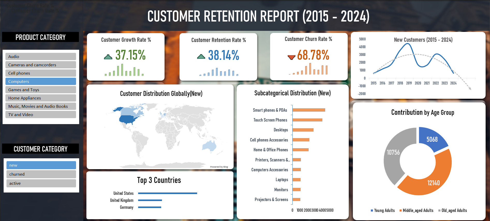

# 📈CUSTOMER RETENTION DASHBOARD

## 📌 Project overview

#### - What did we analyze and visualize:

- 📈 customer growth rate %
- 💹 Customer retention rate %
- 📉 Customer churn rate %
- 🗺️ Customer distribution globally
- 🎚️ Customer distribution subcategorical level
- 🧓 Contribution by age

#### - Why did i built this:

- 🧹 Cleaner and more readable insights via charts and KPIs.
- 🤖 Dynamic and user interactive.
- 🛃 To analyze customer driven performance.

## 📊 Dashboard preview


## 💴 Key insights

- 🖥️ The computers category grew by **37.15%** while maintaining a relatively good customer retention at **38.14%** and a high churn rate at **68.78%**.

- 🗺️ Top 3 countries by new customer count: United states(**7261**), United Kingdom(**2992**) and Germany(**2915**).

- 👥 Within subcategories, Mobiles phones outperforms Destops and other accessories, while monitors and screens has the lowest record.

- 🧓 Middle-aged adults (31 - 60) and old-aged adults (61 - 90) has a fairly equal contibution of about **41%**, whereas young-aged adults (18 - 30) has only **18%** contribution indicating weaker engagement among younger customers.

## 🛠️ Tools used

#### - 🐘 Postgresql:
- A powerful open-source Relational DataBase Management System (RDBMS) used to store, manage and query North_wind dataset.

#### - 🦫 Dbeaver:
- My personal favourite database management tool for exploring, querying and managing relational data.

#### - 💻 Excel:
- A powerful tool to organize data, perform data aggregations and make visuals.

## ⚒️ Project workflow

#### 💉 Data aggregation & extraction:

- Queried the Contoso_100k dataset using postgresql in Dbeaver and exported in csv format.

- The following query aggregates and extracts year from the order_date, creating new columns for each years. The **GROUP BY** clause is then used to summarize the purchase by year.

```sql
WITH customer_order AS (
SELECT
	customerkey AS customer_key,
	categoryname AS category_name,
	orderdate,
	countryfull AS country,
	subcategoryname AS subcategory_name,
	age
FROM
	customer_retention
)

SELECT
	customer_key,
	category_name,
	MAX(CASE WHEN EXTRACT(YEAR FROM orderdate) = 2015 THEN 1 ELSE 0 END) AS order_2015,
	MAX(CASE WHEN EXTRACT(YEAR FROM orderdate) = 2016 THEN 1 ELSE 0 END) AS order_2016,
	MAX(CASE WHEN EXTRACT(YEAR FROM orderdate) = 2017 THEN 1 ELSE 0 END) AS order_2017,
	MAX(CASE WHEN EXTRACT(YEAR FROM orderdate) = 2018 THEN 1 ELSE 0 END) AS order_2018,
	MAX(CASE WHEN EXTRACT(YEAR FROM orderdate) = 2019 THEN 1 ELSE 0 END) AS order_2019,
	MAX(CASE WHEN EXTRACT(YEAR FROM orderdate) = 2020 THEN 1 ELSE 0 END) AS order_2020,
	MAX(CASE WHEN EXTRACT(YEAR FROM orderdate) = 2021 THEN 1 ELSE 0 END) AS order_2021,
	MAX(CASE WHEN EXTRACT(YEAR FROM orderdate) = 2022 THEN 1 ELSE 0 END) AS order_2022,
	MAX(CASE WHEN EXTRACT(YEAR FROM orderdate) = 2023 THEN 1 ELSE 0 END) AS order_2023,
	MAX(CASE WHEN EXTRACT(YEAR FROM orderdate) = 2024 THEN 1 ELSE 0 END) AS order_2024,
	country,
	subcategory_name,
	age
FROM
	customer_order
GROUP BY
	customer_key,
	category_name,
	country,
	subcategory_name,
	age
ORDER BY
	category_name,
	customer_key
```

#### - 📍 Pivoting and aggregation:
 
 - Pivoted the data with Pivot table with a slicer inclusion for category_name field(A dynamic switch between categories for the user).

 - Calculated the first & last purchase years with MIN & MAX formulas.

 - Calculated the active, new and churned customer count with INDEX, IF AND COUNITS and made use of the spilled arrays for dynamic row tracking.

 - count to rate % conversion:

-  - Customer growth rate %(new customer count) = Current year - previous year / previous year
- - Customer retention rate %(active customer count) = Current year - previous year / previous year
- - Customer churn rate %(churned customer count) = Current year churn count / Previous year active count.

- Aggregated by Age, country and subcategory to find new, active and churned customer count.

#### - 💳 KPI cards and visuals:

- Used conditional formatting, text formatting and cell referencing to make KPI cards that track the growth and lose.

- A Map chart for new, active and churned customer distribution throughout countries.

- A Horizontal bar chart for contribution by subcategory.

- A line chart for the trend of new, active and churned customers throughout the years.

## Conclusion

- This dashboard provides dynamic and user interactive indepth view on Customer retention/performance, Enabling users to switch between product and customer categories.

- The key findings strongly suggests even though the customer churn rate is high % for the computer category, the retention and grow rates % are really good, indicating the computer category is one of the better perfoming categories.

- Intergrating SQL, Excel and visual techniques, this project shows the ability to extract, clean, aggregate and visualize actionable insights in a user-friendly format.